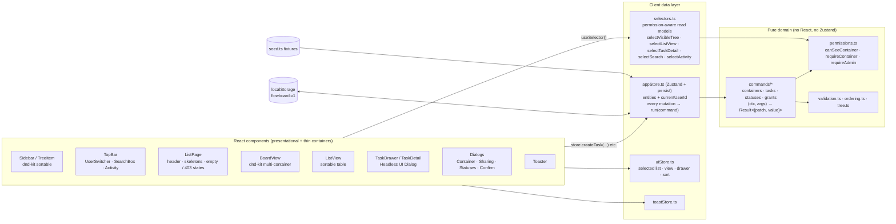

# Flowboard

A mini project-management app (think ClickUp / Linear at hobby scale) for a single workspace:
a **workspace → space → folder → list → task** hierarchy, a **kanban board** and a **list view**,
a **task drawer**, and a **permission model** you can demo by switching between three mock users.

There is no backend. A typed, permission-enforcing client store (Zustand) seeded from fixtures stands in
for the API and the database.

**Stack:** React 18 · TypeScript (strict) · Vite 6 · Tailwind CSS 3 (only) · Zustand 5 · dnd-kit · Headless UI 2 · Vitest + Testing Library · Playwright

---

## 1. Run locally

Requires Node 18+ (developed on Node 22).

```bash
npm install
npm run dev          # http://localhost:5173
```

| Script              | What it does                                                        |
| ------------------- | ------------------------------------------------------------------- |
| `npm run dev`       | Vite dev server                                                     |
| `npm run build`     | Type-check (`tsc -b`) + production build                            |
| `npm run typecheck` | Type-check only                                                     |
| `npm test`          | Unit + store + component tests (Vitest, jsdom)                      |
| `npm run test:e2e`  | Playwright E2E (builds, serves on :4173, runs Chromium)             |

First E2E run: `npx playwright install chromium`. If you already have a Chromium binary, point at it with
`PW_CHROMIUM_PATH=/path/to/chrome npm run test:e2e`.

### 30-second demo script

1. You start as **Alice (admin)** on *Engineering › Q2 Launch › Backlog*. The tree shows both spaces, including the private **Marketing** space (lock icon).
2. Drag a card from **To do** to **In review** — the column highlights, the card lifts, a toast confirms. Reload: it stuck.
3. Open *Marketing › Launch Campaign*, then use **Viewing as** (top right) to switch to **Bob**.
   Marketing disappears from the tree instantly and the board is replaced with a **403 — You don't have access to this list** panel.
4. Switch to **Carol**: she sees Marketing but **not** Backlog (explicit deny) and not Sprint 14 (private, no grant).
5. As Alice, open **Share** on Sprint 14 and set Bob to *Default* → he loses access live (the dialog previews "Can see / Hidden").

**Reset demo data** is at the bottom of the sidebar (admin).

---

## 2. Architecture



Three layers, each with a single job:

- **Domain (`src/domain`)** — plain TypeScript. Models, permission resolution, validation, ordering helpers, and
  **commands**: pure functions `(context, args) → { data: { patch, value } } | { error }`. A command validates
  the input, enforces permissions for `context.actorId`, and computes the entity patch. It never writes.
- **Store (`src/store`)** — `appStore` owns normalised entity maps and the current user. Every mutation is
  `run(command)`: build a context for the current user → execute → apply `patch` only on success. Because the
  write is all-or-nothing, a failed command can never leave a half-updated board. `selectors.ts` are the
  read-side equivalent: every read model is resolved for `currentUserId`.
- **UI (`src/components`)** — renders read models and calls store actions; maps `{ error }` to inline
  field errors or toasts. No component contains a permission or validation rule.

```
src/
  domain/            types · result · permissions · validation · ordering · tree · commands/*
  data/seed.ts       fixtures
  store/             appStore (entities + mutations) · selectors · uiStore · toastStore
  components/
    sidebar/         Sidebar · TreeItem · ArchivedSection
    board/           BoardView · TaskCard · QuickAdd
    list/            ListView (+ pure sortTasks)
    task/            TaskDrawer · TaskDetail · SubtaskList · NewTaskDialog
    dialogs/         ContainerDialog · SharingDialog · StatusesDialog · dialogStore
    layout/          TopBar · UserSwitcher · SearchBox
    activity/        ActivityPanel
    main/            ListPage (header, skeletons, empty / 403 / 404 states)
    ui/              primitives · overlays (Modal, Confirm, Toaster) · SelectMenu
  ui/                tokens.ts (status/priority/avatar class maps) · icons.tsx
  hooks/             useHashRoute (#/list/:id/task/:id deep links)
e2e/                 Playwright specs
```

---

## 3. Data model

All entities live in normalised `Record<id, Entity>` maps (`EntitiesState` in `src/domain/types.ts`).

| Entity        | Key fields                                                                                                   | Notes |
| ------------- | ------------------------------------------------------------------------------------------------------------ | ----- |
| **Container** | `id, name, type, parentId, position, visibility, archivedAt, createdAt, updatedAt`                           | `type ∈ workspace \| space \| folder \| list`. One table for the whole tree. |
| **Status**    | `id, listId, name, category, color, position`                                                                | `category ∈ todo \| in_progress \| done`. Each list owns its set. |
| **Task**      | `id, title, description, statusId, priority, assigneeIds, dueDate, position, primaryListId, parentTaskId, version, createdAt, updatedAt` | `parentTaskId` → one level of subtasks. `version` → optimistic concurrency. |
| **User**      | `id, name, email, role, avatarColor`                                                                          | `role ∈ admin \| member` |
| **Grant**     | `id, resourceId, userId, mode`                                                                               | `mode ∈ allow \| deny`; at most one per (resource, user). |
| **Activity**  | `id, actorId, resourceId, taskId, message, at`                                                               | `resourceId` is used to permission-filter the feed. |

### Integrity rules (enforced in commands, covered by tests)

- **Hierarchy:** the only valid child of a workspace is a space, of a space a folder, of a folder a list
  (`CHILD_TYPE`). Lists hold tasks, never containers → `INVALID_PARENT`.
- **Names:** trimmed, required, ≤ 80 chars, unique among non-archived siblings (case-insensitive) → `CONFLICT`.
- **Ordering:** `position` is always contiguous `0..n-1` within a sibling group (containers), a `(list, status)`
  column (top-level tasks), or a parent (subtasks). Every move/insert/delete/archive renumbers.
- **Tasks:** title required, ≤ 500 chars; status must belong to the task's list; priority from the enum;
  due date must parse as ISO; **assignees must be able to see the list**.
- **Subtasks:** parent must be a top-level task in the same list (max depth 1). Subtasks move with their parent
  and are deleted with it; they cannot be moved to another list on their own.
- **Moving a task to another list:** status is mapped by category (in progress → first in-progress status of the
  target list, else its first status). Assignees who can't see the target list are unassigned, and the UI tells you who.
- **Statuses:** a list always keeps at least one status per category. Deleting a status that has tasks requires a
  target status in the same list; those tasks are appended to it.
- **Stale edits:** the drawer sends `expectedVersion` (the version when you started editing a field). If the task
  changed in the meantime — e.g. in another tab, which re-hydrates via the `storage` event — the store returns `CONFLICT`
  and the drawer reloads the latest values.

### Archive vs delete (documented choice)

- **Containers are soft-deleted (archived).** Only the archived node gets `archivedAt`; descendants are hidden
  implicitly (`isEffectivelyArchived` walks ancestors), so restoring a node brings back its whole subtree and tasks
  untouched. A child can't be restored while its parent is archived. Admins restore from **Archived** in the sidebar.
- **Tasks are hard-deleted**, behind an inline confirmation in the drawer (subtasks: two-step inline confirm).

### Persistence (documented choice)

Entities + current user persist to `localStorage` (`flowboard:v1`, versioned; unknown versions fall back to fresh seed).
Opening a second tab works — writes in one tab re-hydrate the other. UI-only state (selected view, sort) is not persisted;
the selected list/task lives in the URL hash so deep links and back/forward work.

### Error shape

Every mutation and guarded read returns:

```ts
type Result<T> = { data: T } | { error: { code: 'FORBIDDEN' | 'NOT_FOUND' | 'VALIDATION' | 'INVALID_PARENT' | 'CONFLICT'; message: string; fields?: Record<string, string> } };
```

`fields` lets forms show inline messages; everything else becomes a toast (`notify()` in `toastStore.ts`).

---

## 4. How permissions are enforced in the client

**Rules** (`src/domain/permissions.ts`):

1. **Admins** bypass every check.
2. A node is **directly accessible** to a member if there is **no `deny`** grant for them on it, **and** it is
   **public**, or it is **private and they hold an `allow`** grant on it.
3. A node is **visible** if it **and every ancestor** is directly accessible. So a deny on a space hides its whole
   subtree, even if a list underneath has an allow.
4. Members can **create / edit / move / delete tasks** in any list they can see.
5. **Structure** (create / rename / reorder / archive containers, sharing, statuses) is **admin-only**.

**Where they're enforced:**

- **Writes:** every command calls `requireContainer` / `requireTaskEditAccess` / `requireAdmin` before doing anything.
  Moving a task across lists checks *both* lists. A denied call returns `{ error: { code: 'FORBIDDEN' } }` — the
  client-side 403 — and writes nothing (tested: the `tasks` map is referentially unchanged).
- **Reads:** selectors resolve for `currentUserId`. `selectVisibleTree` only returns visible, non-archived nodes;
  `selectListView` / `selectTaskDetail` return `FORBIDDEN` for hidden resources; search, activity and the assignee
  picker are filtered the same way. Components never receive data the user can't see.
- **UI** only *mirrors* the rules (e.g. hides the admin menu for members) — it is not the gate. Deep-linking to a hidden
  list (`#/list/ls_launch` as Bob) renders the 403 panel and a toast.
- Switching users changes `currentUserId`; every selector recomputes on the next render, so the tree, board, open
  drawer, search results and activity update immediately.

**Seeded grants**

| Resource                 | Visibility | Grants                         | Alice | Bob | Carol |
| ------------------------ | ---------- | ------------------------------ | :---: | :-: | :---: |
| Engineering (space)      | public     |                                | ✅ | ✅ | ✅ |
| └ Q2 Launch (folder)     | public     |                                | ✅ | ✅ | ✅ |
| &nbsp;&nbsp;└ Backlog    | public     | Carol **deny**                 | ✅ | ✅ | ❌ |
| &nbsp;&nbsp;└ Sprint 14  | private    | Bob **allow**                  | ✅ | ✅ | ❌ |
| Marketing (space)        | private    | Carol **allow**                | ✅ | ❌ | ✅ |
| └ Campaigns › Launch Campaign | public |                               | ✅ | ❌ | ✅ |

**How I'd extend it**

- **Teams/groups:** add `principalType: 'user' | 'team'` to grants and a `memberships` table. Effective grant for a node =
  user grant if present, else most-restrictive team grant (deny wins). `findGrant` becomes `resolveGrant(node, user)`; the
  ancestor walk stays the same.
- **Roles per resource** (`viewer | editor | manager`) instead of a boolean, so "can see" and "can edit tasks" become
  `atLeast(role, 'editor')` checks — the commands already call a single `require…` helper per operation, so the change is local.
- **Inheritance with overrides:** today an allow can't punch through a parent deny (simple and safe). If product wanted
  "share just this list", I'd make an explicit allow on a descendant grant *path visibility* (ancestors shown as
  greyed-out breadcrumbs) without exposing sibling content.
- **Performance:** visibility is currently computed per call with an ancestor walk (O(depth)) and a cached grant index —
  fine for hundreds of nodes. For thousands, memoise per `(userId, grantsVersion, containersVersion)` into a visible-id set.
- On a real backend these exact checks move server-side; the client keeps them for instant UI and as a second line.

---

## 5. Trade-offs, what I cut, and week 2

**Decisions**

- **Pure commands + thin Zustand store** instead of logic inside Zustand actions: commands are trivially unit-testable
  with plain objects, failures are atomic, and the store file stays ~160 lines.
- **Mutations are synchronous;** loading states come from simulated latency on *queries* (`bootstrap`, list switch,
  450 ms / 270 ms; 0 in tests). Because the store is the source of truth, DnD is effectively optimistic: the board keeps
  a local preview during the drag and commits one `moveTask` on drop; a rejected move simply discards the preview.
- **Kanban DnD with dnd-kit** (keyboard + pointer sensors, `DragOverlay` preview). Cards are fully keyboard-operable:
  `Enter` opens, `Space` picks up / drops, arrows move.
- **Autosave in the drawer** (title on blur/Enter, selects immediately) with a "Saved" indicator, instead of a Save button.
- **Headless UI** for Dialog/Listbox/Menu/Combobox (focus trap, Escape, overlay click, focus restore) — all styled with Tailwind.
- **Hash routing** (≈50 lines) instead of React Router: two routes didn't justify a dependency.
- **Strict hierarchy:** lists can only live in folders, exactly as specified (ClickUp also allows space-level lists — easy to add
  by allowing two child types for spaces).

**Cut / not done**

- Moving containers between parents (only sibling reorder). The command shape supports it; needs cycle checks + UI.
- Pagination of the list view (optional) — in-memory data is tiny.
- Responsive / mobile layout beyond "doesn't break" (desktop-first per the brief).
- Workspace-level settings, user management, dark mode (out of scope).
- Undo for task deletion (there's a confirmation instead).

**Week 2**

1. Swap the store's command runner for an async API client (`fetch` → same `Result` shape) with React Query, keeping
   commands as server handlers; add real optimistic updates with rollback on 4xx.
2. Team-based grants and resource roles (see above); an access-audit view ("why can Bob see this?").
3. Cross-list moves via drag (drop a card on a sidebar list), multi-select + bulk status/assignee.
4. Virtualised columns/rows for large lists; cursor pagination in the list view.
5. Markdown description with preview; comments; due-date reminders.
6. Storybook for primitives; visual regression on the board.

---

## 6. AI usage log

- **Tool:** Claude (Anthropic), used as a pair-programmer for scaffolding, first drafts of commands/components, test cases
  and this README; Playwright screenshots were used to review the UI at each step.
- **Helped most:** boilerplate (Tailwind config tokens, Headless UI wiring), enumerating edge cases for tests, dnd-kit
  multi-container pattern.
- **Corrected / rejected:** a memoised selector hook that ignored its inputs (switching lists showed stale data), Tailwind
  width-class conflicts in shared input styles, stacking a confirm modal on top of a dialog, a keyboard-sensor default that
  made `Enter` both "open" and "pick up", and flaky E2E tests that needed waits and exact label matching.

---

## 7. `style=` exceptions (DnD)

Styling is Tailwind utilities only: one CSS file containing just the three `@tailwind` directives, no CSS modules / SCSS /
CSS-in-JS. The only inline styles in the codebase are the two required by dnd-kit sortables to animate position:

| File                                       | Why |
| ------------------------------------------ | --- |
| `src/components/board/TaskCard.tsx`        | `style={{ transform, transition }}` from `useSortable` on kanban cards |
| `src/components/sidebar/TreeItem.tsx`      | same, for sidebar sibling reordering |

Libraries also set their own inline positioning internally (dnd-kit's `DragOverlay`, Headless UI's floating `anchor`
popovers); none of that is authored here. Dynamic widths (e.g. the list progress bar) use stepped utility classes rather than inline styles.

---

## Stretch goals attempted

1. **Client-side search** on task title + description (top bar, `/` to focus) — across every list *you can see*, opens the task in place.
2. **Activity feed** ("Alice moved *X* to Done") — permission-filtered per viewer, click an entry to jump to the task.

Also within MVP-stretch: **one level of subtasks** (drawer checklist, `n/m` badge on cards and rows).

## Tests

- `src/domain/permissions.test.ts` — admin bypass, public/private, allow/deny, deny-on-ancestor, archived/missing nodes.
- `src/store/appStore.test.ts` — permission-filtered tree/list/task/search/activity; FORBIDDEN on read & every mutation
  (with no partial writes); validation (title length, foreign statuses, assignee access, dates, priority); version conflicts;
  subtask depth; reordering & cross-column/cross-list moves with contiguous positions; hierarchy rules; duplicate names;
  archive/restore cascade; status deletion & reassignment.
- `src/components/list/ListView.test.ts` — sort by priority/due date (no-date sinks), manual order.
- `src/App.test.tsx` — integration: skeleton → tree → first list; Alice → Bob switch hides Marketing and shows 403; drawer opens/Escape closes; members see no admin controls.
- `e2e/*.spec.ts` (Playwright) — pointer drag across columns + persistence after reload; keyboard reorder; drawer Escape/overlay close + autosave;
  quick-add validation; list sorting; user switch; deep-link 403; revoking a grant live.

Every test builds its own store (`makeStore()` / `resetStores()`, fixed clock and ids) — no shared state between tests.
